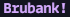
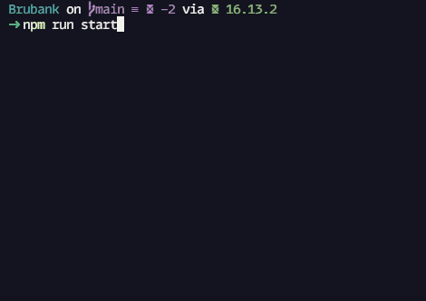

<br />
<p align="center">
    

  <h3 align="center">Brubank! por <a href="https://www.linkedin.com/in/bruno-andreotti/" target='_blank'>Bruno</a>
 <br />
  
 <p align="center">
  <a href="#sobre">Sobre</a> |
  <a href="#conhecimentos-praticados"> Conhecimentos Praticados </a> |
  <a href="#instalando-e-rodando-o-projeto"> Instalando e rodando o projeto </a> |  
  <a href="#tecnologias-utilizadas"> Tecnologias utilizadas </a>      
       <br />
    <br />
    <h1 align="center">
    
 </h1>
  </p>
</p>

# Sobre

O objetivo do projeto foi criar um pequeno sistema de banco com a finalidade de colocar em prática os conhecimentos que adquiri em NodeJs até o momento!

# Conhecimentos Praticados
✔ NodeJS <br>
✔ Core Modules <br>
✔ NPM <br>
✔ Instalação de módulos externos <br>
✔ Inquirer.js <br>
✔ Chalk.js <br>
✔ Import/Export <br>


# Implementações:

## • Criação de conta
  É possível criar uma conta nova escolhendo um nome, uma senha, uma pergunta para a recuperação da senha e uma palavra-chave para a pergunta.

## • Consulta de saldo
  É possível consultar o saldo existente na conta utilizando o nome e a senha da conta.

## • Depósito
  É possível fazer um depósito de uma quantia desejada utilizando o nome e a senha da conta.

## • Saque
  É possível fazer um depósito de uma quantia desejada utilizando o nome e a senha da conta.

## • Tranferência
  É possível fazer tranfêrencia de uma conta existe para outra conta existente utilizando o nome e a senha da conta e o nome da conta que receberá a transferência.

## • Veriricação de contas existentes
  É possível verificar quais as contas existentes no banco.

## • Recureração de senha
  É possível recuperar a senha de uma conta respondendo corretamente a pergunta de recuperação de senha com a palavra-chave escolhida no cadastro.

## • Sair
  É possível sair do sistema na opção 'Sair'.


# Rodando o projeto no seu computador

  ### Pré-requisitos:
Antes de começar, você precisará instalar em sua máquina as seguintes ferramentas:
[Git](https://git-scm.com) e [Node.js](https://nodejs.org/en/). <br> Além disso, é aconselhável ter um editor como o [VSCode](https://code.visualstudio.com/) para trabalhar com o código!

### Instalando e rodando o projeto:
<br>


```bash
# Clone este repositório
$ git clone https://github.com/brunoandreotti/Brubank.git

# Acesse a pasta do projeto no terminal
$ cd Brubank

# Instale as dependências do projeto
$ npm install

# Execute o comando para iniciar a aplicação
$ npm run start
```


# Tecnologias utilizadas

<p align="center">
  
  <a href="https://nodejs.org/en/"></a>
  
</p>

---
